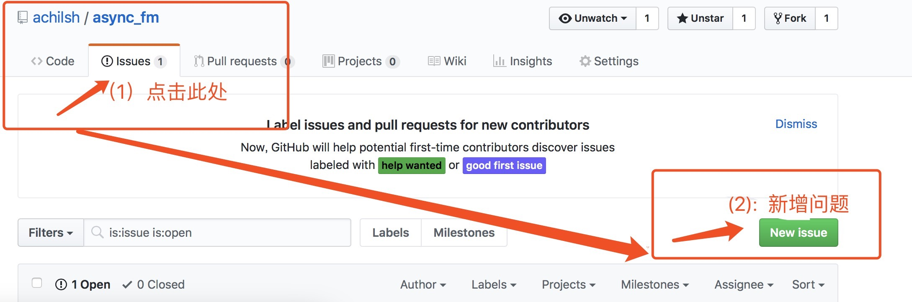

base_frameworks
===============================================
功能点列表
------------
- [cnf_center_framewk] - 完成配置中心，路由分配，自动摘机，手动摘机能力, 热启动集群中任何so.
- [debug_access] - 完成Access的tcp 接入能力测试,在内部协议pb时，动态加载有so问题(TODO).提供通过命令字查询服务名能力.
- [thrift_proto_debug] - 测试内部业务数据用thrift 序列化，用于解决debug_access 分支问题core问题，
- [alarm_report] - 框架提供业务错误告警和框架底层错误告警的发送接口，该接口发送告警到agent模块。后续有专门告警模块推送告警.
- [alarm_report] - 增加告警邮件推送模块 
- [monitor_report_childproc] - 增加独立子进程（非业务子进程）监控业务子进程状态（coredump report, status report and so.)
暴露框架的定时器功能给业务so 使用,增加框架编译加速工具，优化定时器时间设置; 增加manager检测worker,并在其dis-active 下告警
增加底层框架路由时白名单过滤，方便后续线上发布体验（white list配置远程服务已开发,agent已实现),白名单功能完善.
- [monitor_report_childproc] - 增加远程重启子进程能力(在手动摘机后优雅重启)
- [client_thrift_vermonitor] - 增加client以thrift接入系统支持
- [unordered_map_verclient] - 用unordered_map 优化系统部分 map 
- [optim_client_thrift_ver] - 优化thrift协议接入的编解码方式,增加perf cpu,生成火焰图工具,丰富火焰图获取方式.
- [coroutine_ver] - 修改框架，内部服务支持协程模式：http，thrift, 自定义协议接入流程协程化，异步redis 接口协程改造
（再也不用写那些的start()/callback() hell 业务代码了,业务完全可以同步写，底层异步收发）

TODO:
------------
- 1. 父子进程通信效率不高.特别是在父子进程间传输大块数据时。优化点:可用 共享内存和管道相结合方式。管道上传大块数据在共享内存的key,
    共享内存存放父子进程传递的数据。
    这样即可保证新连接的有序性(管道保证)，也能优化父子进程间数据的传递效率(由共享内存提供)

Q & A
------------
- **`bug 提交指引`**

    

